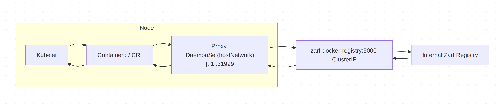

<!--
**Note:** When your ZEP is complete, all of these comment blocks should be removed.

To get started with this template:

- [ ] **Create an issue in zarf-dev/proposals.**
  When creating a proposal issue, complete all fields in that template. One of
  the fields asks for a link to the ZEP, which you can leave blank until the ZEP
  is filed. Then, go back and add the link.
- [ ] **Make a copy of this template directory.**
  Name it `NNNN-short-descriptive-title`, where `NNNN` is the issue number
  (with no leading zeroes).
- [ ] **Fill out as much of the zep.yaml file as you can.**
  At minimum, complete the "Title", "Authors", "Status", and date-related fields.
- [ ] **Fill out this file as best you can.**
  Focus on the "Summary" and "Motivation" sections first. If you've already discussed
  the idea with the Technical Steering Committee, this part should be easier.
- [ ] **Create a PR for this ZEP.**
  Assign it to members of the Technical Steering Committee who are sponsoring this process.
- [ ] **Merge early and iterate.**
  Don’t get bogged down in the details—focus on getting the goals clarified and the
  ZEP merged quickly. You can fill in the specifics incrementally in later PRs.

Just because a ZEP is merged doesn't mean it's complete or approved. Any ZEP marked
as `provisional` is a working document and subject to change. You can mark unresolved
sections like this:

```
<<[UNRESOLVED optional short context or usernames ]>>
Stuff that is being argued.
<<[/UNRESOLVED]>>
```

When editing ZEPs, aim for focused, single-topic PRs to keep discussions clear. If
you disagree with a section, open a new PR with suggested changes.

Each ZEP covers one "feature" or "enhancement" throughout its lifecycle. You don’t
need a new ZEP for moving from beta to GA. If new details emerge, edit the existing
ZEP. Once a feature is "implemented", major changes should go in new ZEPs.

The latest instructions for this template can be found in [this repo](/NNNN-zep-template/README.md).

**Note:** PRs to move a ZEP to `implementable`, or significant changes to an
`implementable` ZEP, must be approved by all ZEP approvers. If an approver is no
longer appropriate, updates to the list must be approved by the remaining approvers.
-->

# ZEP-0032: Initial IPv6 support

<!--
Keep the title short simple and descriptive. It should clearly convey what
the ZEP is going to cover.
-->

<!--
A table of contents helps reviewers quickly navigate the ZEP and highlights
any additional information provided beyond the standard ZEP template.
-->

<!-- toc -->
- [Summary](#summary)
- [Motivation](#motivation)
  - [Goals](#goals)
  - [Non-Goals](#non-goals)
- [Proposal](#proposal)
  - [User Stories (Optional)](#user-stories-optional)
    - [Story 1](#story-1)
    - [Story 2](#story-2)
  - [Risks and Mitigations](#risks-and-mitigations)
- [Design Details](#design-details)
  - [Test Plan](#test-plan)
      - [Prerequisite testing updates](#prerequisite-testing-updates)
      - [Unit tests](#unit-tests)
      - [e2e tests](#e2e-tests)
  - [Graduation Criteria](#graduation-criteria)
  - [Upgrade / Downgrade Strategy](#upgrade--downgrade-strategy)
  - [Version Skew Strategy](#version-skew-strategy)
- [Implementation History](#implementation-history)
- [Drawbacks](#drawbacks)
- [Alternatives](#alternatives)
- [Infrastructure Needed (Optional)](#infrastructure-needed-optional)
<!-- /toc -->

## Summary

<!--
This section is key for creating high-quality, user-focused documentation
like release notes or a roadmap. You should gather this info before
implementation starts to keep the focus on development, not writing. ZEP
editors should ensure the `Summary` is clear and useful for a broad audience.

A good summary should be at least a paragraph long.

Follow the [documentation style guide] for this section and the rest of the ZEP.
Keep line lengths reasonable to make it easier for reviewers to provide
feedback and reduce unnecessary changes.

[documentation style guide]: https://docs.zarf.dev/contribute/style-guide/
-->

The default Zarf registry uses a NodePort service on 127.0.0.1. This was done as the most popular container runtime interfaces (CRI) allow insecure connections to localhost by default. However, connection to NodePort services via localhost is blocked by certain distros, IPv6 single stack clusters, and NFTables. This ZEP proposes introducing a hostNetwork or hostPort proxy daemonset which will improve the registry security posture and enable it for these use cases.

## Motivation

<!--
This section is for explicitly listing the motivation, goals, and non-goals of
this ZEP.  Describe why the change is important and the benefits to users. You
can also optionally include links to [experience reports], [community slacks],
or other references to show the community's interest in the ZEP.

[experience reports]: https://go.dev/wiki/ExperienceReports
[openssf slack]: https://openssf.slack.com/archives/C07AKUMBDMJ
[kubernetes slack]: https://kubernetes.slack.com/archives/C03B6BJAUJ3
-->

Kubernetes 1.33 has made [NFTables](https://kubernetes.io/blog/2025/02/28/nftables-kube-proxy/) generally available. The NFTables designers have made the explicit choice to stop making NodePort services accessible on 127.0.0.1 (https://kubernetes.io/docs/reference/networking/virtual-ips/#migrating-from-iptables-mode-to-nftables). NFTables is not enabled by default, however we can expect distros, especially security-focused or performance-oriented distros, to start adopting NFTables by default in the coming months or years. It's important that the Zarf registry will work by default in these distros. 

The current NodePort service solution does not support IPv6 as IPv6 does not enable route_localnet which is required to call NodePort services using [::1] ([#90236](https://github.com/kubernetes/kubernetes/issues/90236#issuecomment-624721859)). There is a mandate ([wayback machine link because white house site is flaky ATM](https://web.archive.org/web/20250116092323/https://www.whitehouse.gov/wp-content/uploads/2020/11/M-21-07.pdf)) for government agencies to migrate to IPv6 single stack by end of fiscal year (FY) 2025. Given how often Zarf is used in government environments it's important IPv6 is enabled. TODO: are IPV6 address free in some cloud environments like AWS? 

The NodePort solution does not work by default on certain distros such as talos and OpenShift (I need to verify that openshift works with the hostport solution).

The registry proxy solution comes with security advantages. The registry will only be accessible from within the cluster or the loopback address on the node. This is an advantage over the NodePort solution where the registry is accessible externally to anyone who can connect a node. Additionally, we will secure the call from socat to the registry with TLS. This way the only unencrypted traffic from the registry is from the kubelet to the proxy, and is exclusively on the host.  

### Goals


* Create a simple way for users to initialize Zarf with the internal registry in a cluster using IPv6 or NFTables.

### Non-Goals

<!--
What is out of scope for this ZEP? Listing non-goals helps to focus discussion
and make progress.
-->

* Remove current mechanism for bootstrapping Zarf in IPv4-only or IPv4/IPv6 dual-stack clusters (that is, using a `Service` of type `NodePort` and the "the route localnet hack"). At least in the short term

## Proposal

<!--
This is where you explain the specifics of the proposal. Provide enough detail
for reviewers to clearly understand what you're proposing, but avoid including
too many specifics like API designs or implementation details. Focus on the
desired outcome and how success will be measured. The "Design Details" section
below is for the real nitty-gritty.
-->

A new flag called `--registry-proxy` will be added to `zarf init` and will change how the registry is connected to within the cluster. When `--registry-proxy` is used Zarf will replace the NodePort service with a clusterIP service and a `DaemonSet` running a proxy on each node to forward the registry. The proxy will use `hostIP` and `hostPort` in IPV4 and dual IP stacks, and hostNetwork in IPv6 only clusters. A `DaemonSet` will be required both for the injector and long lived registry. This process works because calls from the kubelet to localhost no longer will get re-routed off of the node. The kubelet calls the proxy pod on each node, and the proxy then reaches out to the registry. The connection from the proxy to the registry will be secured over mTLS so no unencrypted traffic will leave the node. 



A user can run `--registry-proxy` during `zarf init` and their choice will be saved to the cluster and used on subsequent runs during `init`. If a user wants to switch back to the localhost NodePort solution they must run `zarf init --registry-proxy=false`. If a user runs `zarf init` without the `--registry-proxy` flag on an already initialized cluster, it will keep using the registry connect method that the cluster is currently using, whether that is the registry proxy or NodePort solution. 

When a node is added to the cluster, the daemonset will attempt to create a new proxy image however, there will be no injector on the node for the proxy to pull from. Users will need to re-run `zarf init` in order for the proxy to pull an image. To solve this we could have a small controller in the cluster that monitors the proxy daemonset for the status `ErrImagePull` or `ImagePullBackOff`. When a proxy pod is in one of these statuses we spin up the injector daemonset and wait for the proxy daemonset to be healthy. We would still need the original injector during the first `zarf init` as a controller could not be spun up without avoiding the chicken and egg problem. 

### User Stories (Optional)

<!--
Detail the things that people will be able to do if this ZEP is implemented.
Include as much detail as possible so that people can understand the "how" of
the system. The goal here is to make this feel real for users without getting
bogged down.
-->

#### Story 1

As a administrator of a Kubernetes cluster configured in IPv6-only networking mode, I want to deploy the Zarf init package using the default in cluster registry so I run the `zarf init` with the `--registry-proxy` command line flag.

#### Story 2

As a administrator of a Kubernetes cluster I want to move to NFTable for the performance and security improvements. To enable NFTables in my Zarf cluster I run `zarf init --registry-proxy`

### Risks and Mitigations

<!--
What are the risks of this proposal, and how do we mitigate? Think broadly.
For example, consider both security and how this will impact the larger
Zarf ecosystem.

How will security be reviewed, and by whom?

How will UX be reviewed, and by whom?
-->

hostPort can be used in the daemonset on IPv4, which will limit the connections to the proxy to only those on the actual node, however since IPv6 does not support rewriting packets to [::1] the hostPort strategy will not work. IPv6 will have to use hostNetwork instead. We can still guarantee that the registry is only connected to localhost since packets cannot the proxy will bind to [::1] and localhost packets cannot be re-routed in IPv6. However, hostNetwork comes with other security issues, notably that the pod has the ability to take over or listen to any port on the system. 

<!-- Network policies are not considered in the host IP or Host Network setup so if someone wanted to block certain namespaces from the Zarf registry they would no longer be able to. TODO: I need to verify this.  -->

Increased attack vector, if someone were to gain access to the proxy pod in the daemonset, they could break the registry or potentially forward malicious content. There are additional concerns with the IPv6 solution where pods will have `hostNetwork: true`. An attacker who has taken over the registry proxy pod would have the ability to bind to any free port on the node. For now we are using the default alpine socat image which includes a shell. In the future we could use a different image for the proxy that has no shell to limit this possibility. 

<!-- The daemonset pod will not be monitored by a sidecar / istio? TODO: figure this out. Also does the istio host mode change this? -->

The baseline [pod security standards](https://kubernetes.io/docs/concepts/security/pod-security-standards/) recommend that pods baseline pods should set hostPort or HostNetwork. Users with controllers, such as Kyverno, that enforce these standards will need to make an exemption. Additionally, some distros will disable hostPorts / hostNetworks by default and users will need to use admin permissions to allow these features. For example, Openshift requires hostPort pods to be run with a privileged service account while Talos requires `kubectl label namespace zarf pod-security.kubernetes.io/enforce=privileged --overwrite` to make the Zarf namespace privileged. If the hostPort proxy becomes the default registry configuration, Zarf must document which settings are required to enable the hostPort solution to make it work in different clusters ([#3686](https://github.com/zarf-dev/zarf/issues/3686)). Zarf already assumes that the user is a cluster admin, however if we wanted to change this assumption in the future this proposal will make it more difficult for some clusters.

Some users may rely on calling the NodePort service outside of the cluster. In this case, they would no longer be able to do this by default. They would instead have to setup their own service to connect to the registry. 

Practical risks:
- Some distros may disallow this
  - Kind - works
  - K3D - works
  - microk8s - works
  - talos - works, but needs to make the Zarf namespace privileged
  - k0s - almost certainly works, but I need to get PVCs working on it to test 100%  
  - k3s - tbd
  - RKE2 - tbd
  - openshift - more testing to do. HostNetwork works, but I'm having trouble with IPv4. At least need to run `oc adm policy add-scc-to-user privileged -z my-zarf-sa -n zarf`
- Some CNIs may disallow host network or host port
  - flannel - works
  - calico - works

## Design Details

<!--
This section should contain enough information that the specifics of your
change are understandable. This may include API specs (though not always
required) or even code snippets. If there's any ambiguity about HOW your
proposal will be implemented, this is the place to discuss that.
-->

Initially the proxying component will be based on an existing container image using the `socat` binary ([Alpine socat](https://hub.docker.com/r/alpine/socat)); this is a small and simple image.

`zarf init` will fail if both `--registry-proxy` and `--registry-url` are used.

TLS will be run between the proxy and the registry. Zarf will create its own, self-signed, certificates to start for the alpha release. By the beta release Zarf will accept certs if given, otherwise it will create it's own. TODO: much more detail on the mtls process and implications. 

In order for the controller to start the injection it will need the configmap payloads in the cluster. To achieve this the payload configmaps will no longer be deleted from the cluster during `zarf init`. This amounts to about an additional ~32mb of configmaps stored in the cluster permanently. 
 
### Test Plan

<!--
**Note:** *Not required until targeted at a release.*
The goal is to ensure that we don't accept proposals with inadequate testing.

All code is expected to have adequate tests (eventually with coverage
expectations). Please adhere to the [Zarf testing guidelines][testing-guidelines]
when drafting this test plan.

[testing-guidelines]: https://docs.zarf.dev/contribute/testing/
-->

We should have a test that verifies that `zarf init --registry-proxy` works with both NFTables and IPv6. We should make sure that `zarf init --registry-proxy` goes through the full end-to-end testing suite.

[ ] I/we understand the owners of the involved components may require updates to
existing tests to make this code solid enough prior to committing the changes necessary
to implement this proposal.

### Graduation Criteria

<!--
**Note:** *Not required until you're targeting a release.*

Define what needs to happen for this feature to move from alpha to beta to GA
(General Availability). Focus on key signals or criteria that show the feature
is ready for each stage.

Consider the following stages when setting graduation criteria:
- Alpha: Feature is behind a feature flag, basic tests in place.
- Beta: Gather feedback from users, complete core features, add more tests.
- GA: Prove real-world usage, complete rigorous testing, gather feedback.

In general, features should wait at least two releases between Beta and GA to
allow time for feedback. For features moving to GA, include conformance tests
to ensure stability and compatibility.

#### Deprecation
If this feature will eventually be deprecated, plan for it:
- Announce deprecation and support policy.
- Wait at least two versions before fully removing it.
-->

### Upgrade / Downgrade Strategy

<!--
If applicable, how will the component be upgraded and downgraded? Make sure
this is in the test plan.

Consider the following in developing an upgrade/downgrade strategy for this
proposal:
- What changes (in invocations, configurations, API use, etc.) is an existing
  package definition or deployment required to make on upgrade, in order to
  maintain previous behavior?
- What changes (in invocations, configurations, API use, etc.) is an existing
  package definition or deployment required to make on upgrade, in order to
  make use of the proposal?
-->


### Version Skew Strategy

<!--
If applicable, how will the component handle version skew with other
components? What are the guarantees? Make sure this is in the test plan.

Consider the following in developing a version skew strategy for this
proposal:
- Does this proposal involve coordinating behavior between components?
  - (i.e. the Zarf Agent and CLI? The init package and the CLI?)
-->

## Implementation History

<!--
Major milestones in the lifecycle of a ZEP should be tracked in this section.
Major milestones might include:
- the `Summary` and `Motivation` sections being merged, signaling acceptance of the ZEP
- the `Proposal` section being merged, signaling agreement on a proposed design
- the date implementation started
- the first Zarf release where an initial version of the ZEP was available
- the version of Zarf where the ZEP graduated to general availability
- when the ZEP was retired or superseded
-->

## Drawbacks

<!--
Why should this ZEP _not_ be implemented?
-->

Code complexity, at least in the short term as the injector and init package needs to support two paths, one for the NodePort service and one for host proxy.

There is an extra process required to make new nodes work with the registry

There is inherent downtime with this solution when a proxy is restarted. A solution that continuously pulls images, such as a gitlab runner, may notice if a proxy registry is down. This should only happen when a user manually intervenes, or when the version of the proxy container is updated and the image is rolled during `zarf init`.

Extra compute will be used in the cluster to run the registry proxy. This pod will not need much compute power, it will be limited to X CPU and Y Memory by default <- TODO

## Alternatives

<!--
What other approaches did you consider, and why did you rule them out? These do
not need to be as detailed as the proposal, but should include enough
information to express the idea and why it was not acceptable.
-->

One alternative would be to add TLS to the current NodePort solution by providing certs to Containerd. Containerd has the ability to hot reload certs so using a daemonset to edit the containerd config on the host nodes to point to self signed certificates would allow Zarf to automatically configure a secure connection. This would have the advantage of avoiding hostPort or hostNetwork, however the pod would need to run in privileged mode to allow it to edit files. Additionally, this solution would not be CRI agnostic, it would only work with containerd. Potentially, it could be expanded to work with other CRI's however it would require a CRI specific implementation for each new CRI and the CRI would need to support reloading the certificates without being restarted. 

In a later stage, the proxy component could be replaced by a component similar to the Rust Zarf injector (or even the Zarf injector itself - a proxy based on the Rust Tokyo library - already part of the used libraries - is only a few lines of code).


## Infrastructure Needed (Optional)

<!--
Use this section if you need things from the project. Examples include a new repo,
cloud infrastructure for testing or GitHub details. Listing these here
allows the process to get these resources to be started right away.
-->


<!-- 
FIXME: delete these notes
- ClusterIP works from the node, but cluster DNS does not. You cannot use http://zarf-registry.zarf.svc.cluster.local:5000/v2 from the node for example. 
- What if the service needs to be re-created and it's created with a different clusterIP
  - If an image is pushed to an OCI registry and the domain changes, the image doesn't change.
  - There should
- What about the automatic port forward to 127.0.0.1:31999 on commands like `zarf tools registry ls 127.0.0.1:31999/path`. Likely we will have a DNS name that replicates it. 
- I believe we'll have to make config for several different container runtime interfaces so we can give a cert without trusting the cert at the node level
- I need to evaluate the proxy method to the local host registry and see if it can be better secured
- I'll need to check the use of different signing keys
- I will need to test the difference that a proxy makes. For example, does a proxy make openshift work? Does a proxy make things work with NFtables instead of IP tables.   -->

