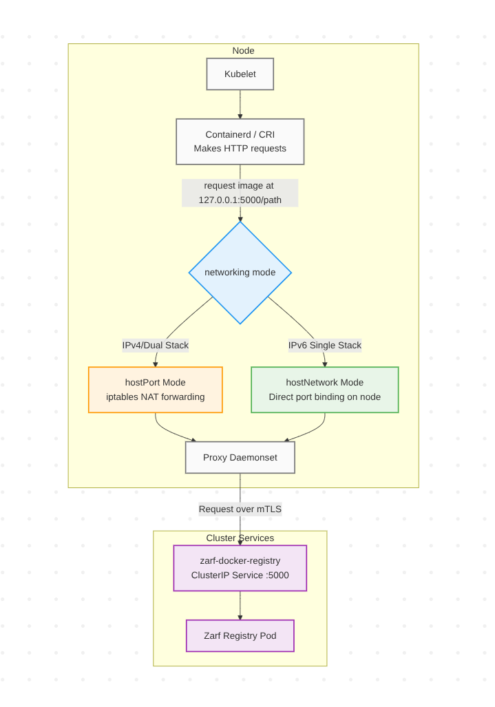

<!--
**Note:** When your ZEP is complete, all of these comment blocks should be removed.

To get started with this template:

- [ ] **Create an issue in zarf-dev/proposals.**
  When creating a proposal issue, complete all fields in that template. One of
  the fields asks for a link to the ZEP, which you can leave blank until the ZEP
  is filed. Then, go back and add the link.
- [ ] **Make a copy of this template directory.**
  Name it `NNNN-short-descriptive-title`, where `NNNN` is the issue number
  (with no leading zeroes).
- [ ] **Fill out as much of the zep.yaml file as you can.**
  At minimum, complete the "Title", "Authors", "Status", and date-related fields.
- [ ] **Fill out this file as best you can.**
  Focus on the "Summary" and "Motivation" sections first. If you've already discussed
  the idea with the Technical Steering Committee, this part should be easier.
- [ ] **Create a PR for this ZEP.**
  Assign it to members of the Technical Steering Committee who are sponsoring this process.
- [ ] **Merge early and iterate.**
  Don’t get bogged down in the details—focus on getting the goals clarified and the
  ZEP merged quickly. You can fill in the specifics incrementally in later PRs.

Just because a ZEP is merged doesn't mean it's complete or approved. Any ZEP marked
as `provisional` is a working document and subject to change. You can mark unresolved
sections like this:

```
<<[UNRESOLVED optional short context or usernames ]>>
Stuff that is being argued.
<<[/UNRESOLVED]>>
```

When editing ZEPs, aim for focused, single-topic PRs to keep discussions clear. If
you disagree with a section, open a new PR with suggested changes.

Each ZEP covers one "feature" or "enhancement" throughout its lifecycle. You don’t
need a new ZEP for moving from beta to GA. If new details emerge, edit the existing
ZEP. Once a feature is "implemented", major changes should go in new ZEPs.

The latest instructions for this template can be found in [this repo](/NNNN-zep-template/README.md).

**Note:** PRs to move a ZEP to `implementable`, or significant changes to an
`implementable` ZEP, must be approved by all ZEP approvers. If an approver is no
longer appropriate, updates to the list must be approved by the remaining approvers.
-->

# ZEP-0033: Registry Proxy

<!--
Keep the title short simple and descriptive. It should clearly convey what
the ZEP is going to cover.
-->

<!--
A table of contents helps reviewers quickly navigate the ZEP and highlights
any additional information provided beyond the standard ZEP template.
-->

<!-- toc -->
- [Summary](#summary)
- [Motivation](#motivation)
  - [Goals](#goals)
  - [Non-Goals](#non-goals)
- [Proposal](#proposal)
  - [User Stories (Optional)](#user-stories-optional)
    - [Story 1](#story-1)
  - [Risks and Mitigations](#risks-and-mitigations)
- [Design Details](#design-details)
  - [Test Plan](#test-plan)
      - [Prerequisite testing updates](#prerequisite-testing-updates)
      - [Unit tests](#unit-tests)
      - [e2e tests](#e2e-tests)
  - [Graduation Criteria](#graduation-criteria)
  - [Upgrade / Downgrade Strategy](#upgrade--downgrade-strategy)
  - [Version Skew Strategy](#version-skew-strategy)
- [Implementation History](#implementation-history)
- [Drawbacks](#drawbacks)
- [Alternatives](#alternatives)
- [Infrastructure Needed (Optional)](#infrastructure-needed-optional)
<!-- /toc -->

## Summary

<!--
This section is key for creating high-quality, user-focused documentation
like release notes or a roadmap. You should gather this info before
implementation starts to keep the focus on development, not writing. ZEP
editors should ensure the `Summary` is clear and useful for a broad audience.

A good summary should be at least a paragraph long.

Follow the [documentation style guide] for this section and the rest of the ZEP.
Keep line lengths reasonable to make it easier for reviewers to provide
feedback and reduce unnecessary changes.

[documentation style guide]: https://docs.zarf.dev/contribute/style-guide/
-->

The Zarf registry uses a NodePort service on 127.0.0.1. This was done as the most popular container runtime interfaces (CRI) allow insecure connections to localhost by default. However, connection to NodePort services via localhost is blocked by certain distros, IPv6 single stack clusters, and NFTables. This ZEP proposes introducing a hostNetwork or hostPort proxy daemonset. This solution will improve the registry's security posture and enable support for these use cases.

## Motivation

<!--
This section is for explicitly listing the motivation, goals, and non-goals of
this ZEP.  Describe why the change is important and the benefits to users. You
can also optionally include links to [experience reports], [community slacks],
or other references to show the community's interest in the ZEP.

[experience reports]: https://go.dev/wiki/ExperienceReports
[openssf slack]: https://openssf.slack.com/archives/C07AKUMBDMJ
[kubernetes slack]: https://kubernetes.slack.com/archives/C03B6BJAUJ3
-->

Kubernetes 1.33 has made [NFTables](https://kubernetes.io/blog/2025/02/28/nftables-kube-proxy/) generally available. The NFTables designers have made the explicit choice to stop making NodePort services accessible on 127.0.0.1 (https://kubernetes.io/docs/reference/networking/virtual-ips/#migrating-from-iptables-mode-to-nftables). NFTables is currently not enabled by default, however we can expect security-focused or performance-oriented distros to start adopting NFTables in the coming months or years. It's important that the Zarf registry will work for these distros. Talos for instance has started defaulting to NFTables.

The current NodePort service solution does not support IPv6 as IPv6 does not enable route_localnet which is required to call NodePort services using [::1] ([#90236](https://github.com/kubernetes/kubernetes/issues/90236#issuecomment-624721859)). There is a mandate ([wayback machine link because white house site is flaky ATM](https://web.archive.org/web/20250116092323/https://www.whitehouse.gov/wp-content/uploads/2020/11/M-21-07.pdf)) for government agencies to migrate to IPv6 single stack by end of fiscal year (FY) 2025. Given how often Zarf is used in government environments it's important IPv6 is enabled.
A similar issue also makes the Zarf registry unusable for distros such as OpenShift which blocks rewriting traffic to localhost. In both of these situations, hostPort will not work, however hostNetwork will. 

The registry proxy solution comes with security advantages. The registry will only be accessible from within the cluster. This is an advantage over the current solution since NodePort services default to being accessible externally to anyone who can connect to a node. Additionally, we will force the registry to connect to the proxy and Zarf CLI with mTLS. With this approach, the only unencrypted traffic during a kubelet call occurs between the kubelet and proxy, ensuring this traffic never leaves the host. The Zarf CLI will connect directly to the registry over mTLS and Kubernetes port forwards.

### Goals


* Create a simple way for users to initialize Zarf with the internal registry in a cluster using IPv6 or NFTables.
* Encrypt all cross-network traffic to the registry over mTLS.

### Non-Goals

<!--
What is out of scope for this ZEP? Listing non-goals helps to focus discussion
and make progress.
-->

* Remove current mechanism for bootstrapping Zarf using a `Service` of type `NodePort`. At least in the short term.

## Proposal

<!--
This is where you explain the specifics of the proposal. Provide enough detail
for reviewers to clearly understand what you're proposing, but avoid including
too many specifics like API designs or implementation details. Focus on the
desired outcome and how success will be measured. The "Design Details" section
below is for the real nitty-gritty.
-->

A new `--registry-proxy` flag will be added to zarf init. Enabling this flag causes Zarf to create a DaemonSet running a proxy on each node that will connect directly to the registry service. Both the injector and proxy will require DaemonSets, and the injector will be long lived. Eventually, `--registry-proxy` may default to true. 
The proxy will either use hostIP and hostPort or hostNetwork. hostPort is preferred as it presents lower security risk. hostNetwork will be required when redirecting traffic from localhost to a different IP is disabled, such as in IPv6 single stack clusters or in some distros with custom IP table rules, such as OpenShift. HostPort will be used for IPv4 and dual stack clusters, while hostNetwork will be used for IPv6 clusters. There will also be a Zarf package variable that allows users to use hostNetwork.  



A user can run `--registry-proxy` during `zarf init` and their choice will be saved to the cluster and used on subsequent runs during `init`. If a user wants to switch back to the localhost NodePort solution they must run `zarf init --registry-proxy=false`. If a user runs `zarf init` without the `--registry-proxy` flag on an already initialized cluster, Zarf will continue using the registry setup that was used during the initial init, whether that is the registry proxy or NodePort solution. 

The proxy and the registry will connect over mTLS. Zarf will create a certificate authority along with a client and server certificate using the authority. If a certificate has less than half of its total lifecycle remaining, then it will be rotated automatically during `zarf init`. Users will be able to specify their own certificates through flags on `zarf init`: `--registry-server-cert-file`, `--registry-server-key-file`, `--registry-client-key-file`, and `--registry-client-cert-file`. 

### User Stories (Optional)

<!--
Detail the things that people will be able to do if this ZEP is implemented.
Include as much detail as possible so that people can understand the "how" of
the system. The goal here is to make this feel real for users without getting
bogged down.
-->

#### Story 1

As an administrator of a Kubernetes cluster who wants a greater security posture when using the Zarf registry, I run `zarf init --registry-proxy`.

### Risks and Mitigations

<!--
What are the risks of this proposal, and how do we mitigate? Think broadly.
For example, consider both security and how this will impact the larger
Zarf ecosystem.

How will security be reviewed, and by whom?

How will UX be reviewed, and by whom?
-->

hostPort works by adding rules to the NAT table so that any traffic destined for port 5000 on the node is forwarded to the pod IP at port 5000. This can be confirmed by running `iptables -t nat -L` on a node with a pod that has `hostPort: 5000` and `hostIP: 127.0.0.1`. Since hostIP is set to 127.0.0.1 traffic is only redirected if its destination is localhost.
```bash
target     prot opt source               destination         
CNI-HOSTPORT-SETMARK  tcp  --  10.244.0.0/24        localhost            tcp dpt:5000
CNI-HOSTPORT-SETMARK  tcp  --  localhost            localhost            tcp dpt:5000
DNAT       tcp  --  anywhere             localhost            tcp dpt:5000 to:10.244.0.6:5000
```
HostNetwork works by binding directly to the node. This can be confirmed by running `lsof -i :5000` on a node with a hostNetwork pod binding to port 5000.
```bash
COMMAND    PID     USER   FD   TYPE  DEVICE SIZE/OFF NODE NAME
zarf-inje 2161     1000    6u  IPv6 3568888      0t0  TCP *:5000 (LISTEN)
```
hostNetwork doesn't have an equivalent option to hostIP, which lets hostPort drop connections that aren't destined for 127.0.0.1. To achieve the same effect, the proxy will be configured to only process requests if the destination is localhost.

hostPort and hostNetwork both present an attack vector. If someone were to gain access to the proxy pod or injector pod they could break the connection to the registry or return malicious content. If hostNetwork is enabled the pod would have access to the root network namespace on the node so the attack vector is much larger. To make this attack more difficult the image used in the proxy should have minimal binaries and no shell. The image used in the injector should also be the smallest image available across the cluster, usually the pause image which also has no shell. Additionally, the containers will use the following security context:
```yaml
securityContext:
  allowPrivilegeEscalation: false
  capabilities:
    drop:
    - ALL
  readOnlyRootFilesystem: true
  runAsNonRoot: true
```

The baseline [pod security standards](https://kubernetes.io/docs/concepts/security/pod-security-standards/) recommends that pods should not set hostPort or HostNetwork. Users with controllers that enforce these standards, such as Kyverno, will need to make an exemption. Additionally, some distros will disable hostPort and hostNetwork by default and users will need to use admin permissions to allow these features. 
For example, OpenShift requires hostPort or hostNetwork pods to be run with a privileged service account while Talos requires that the namespace be privileged for hostPort to be enabled. For this feature to be considered stable, the Zarf documentation must include instructions for which settings to change to enable hostPort / hostNetwork on the most common Kubernetes distributions. Zarf currently has no distro specific documentation, but plans to add this, see ([#3686](https://github.com/zarf-dev/zarf/issues/3686)).

The registry is no longer accessible from outside of the cluster by default. Some users may rely on this, and will instead have to setup their own exposed service to connect to the registry.

The root CA, the server (registry) certificate, and the client (proxy) certificate will all be stored in the cluster in the same format as secrets created with [kubectl create secret tls](https://kubernetes.io/docs/reference/kubectl/generated/kubectl_create/kubectl_create_secret_tls/). Users will need to ensure there are tight controls on these secrets to avoid them being maliciously updated or leaked.

## Design Details

<!--
This section should contain enough information that the specifics of your
change are understandable. This may include API specs (though not always
required) or even code snippets. If there's any ambiguity about HOW your
proposal will be implemented, this is the place to discuss that.
-->

Initially, the proxying component will be based on an existing container image using the `socat` binary ([Alpine socat](https://hub.docker.com/r/alpine/socat)). This may evolve to a custom proxy that we create using go. A custom proxy could be useful to run alongside `zarf connect registry` so that tls can be enabled.

`zarf init` will fail if both `--registry-proxy` and `--registry-url` are used. Similarly, init will fail if any of the `--registry-*-file` flags are not empty and `--registry-proxy` is not true.

Running the injector as a daemonset in the airgap requires an image baked into every node, but there is not a distro agnostic way to verify this. The nodeport injector only needs to find one running pod and it can schedule itself on the same node using the same image.
It is not valid to assume a multi-node cluster has a pod running on each node so the DaemonSet injector cannot use this strategy. However, every node has a field `.status.images`, which Zarf will use to find the newest [pause](https://github.com/kubernetes/kubernetes/tree/master/build/pause) image. Zarf will determine if an image is a pause image by checking if it's less than 1MiB, current versions of the pause image are around ~300kb, and if they have pause in the name. Zarf will select the newest pause image on any node as it is the most likely to have an active registry serving it. If no pause image is found, then Zarf will fallback to the smallest image in the cluster.

The long lived injector means that the payload configmaps will no longer be deleted from the cluster during `zarf init --registry-proxy`. This amounts to about an additional 32mb of configmaps stored in the cluster permanently.

In order to allow the Zarf CLI to connect to the internal registry over mTLS Zarf will configure any https requests to the registry to use the CA and client certificates by pulling them from the cluster.

 
### Test Plan

<!--
**Note:** *Not required until targeted at a release.*
The goal is to ensure that we don't accept proposals with inadequate testing.

All code is expected to have adequate tests (eventually with coverage
expectations). Please adhere to the [Zarf testing guidelines][testing-guidelines]
when drafting this test plan.

[testing-guidelines]: https://docs.zarf.dev/contribute/testing/
-->

There should be a test that verifies that `zarf init --registry-proxy` works with both NFTables and IPv6. These should both go through the entire e2e suite.

[X] I/we understand the owners of the involved components may require updates to
existing tests to make this code solid enough prior to committing the changes necessary
to implement this proposal.

### Graduation Criteria

<!--
**Note:** *Not required until you're targeting a release.*

Define what needs to happen for this feature to move from alpha to beta to GA
(General Availability). Focus on key signals or criteria that show the feature
is ready for each stage.

Consider the following stages when setting graduation criteria:
- Alpha: Feature is behind a feature flag, basic tests in place.
- Beta: Gather feedback from users, complete core features, add more tests.
- GA: Prove real-world usage, complete rigorous testing, gather feedback.

In general, features should wait at least two releases between Beta and GA to
allow time for feedback. For features moving to GA, include conformance tests
to ensure stability and compatibility.

#### Deprecation
If this feature will eventually be deprecated, plan for it:
- Announce deprecation and support policy.
- Wait at least two versions before fully removing it.
-->

Alpha: The `--registry-proxy` flag is introduced and E2E tested. It will start behind a feature flag.
Beta: Maintainers have validated that this is a solution Zarf should support long term. Zarf gives users the ability to provide their own CAs. It uses mTLS between the proxy and the registry. The proxy daemonset handles new nodes introduced to the cluster automatically.
Stable: The feature has been validated and users are happy with the UX. The Zarf documentation provides information on how common distros can be configured to allow hostPort or hostNetwork. `--registry-proxy` defaults to true. 

### Upgrade / Downgrade Strategy

<!--
If applicable, how will the component be upgraded and downgraded? Make sure
this is in the test plan.

Consider the following in developing an upgrade/downgrade strategy for this
proposal:
- What changes (in invocations, configurations, API use, etc.) is an existing
  package definition or deployment required to make on upgrade, in order to
  maintain previous behavior?
- What changes (in invocations, configurations, API use, etc.) is an existing
  package definition or deployment required to make on upgrade, in order to
  make use of the proposal?
-->


### Version Skew Strategy

<!--
If applicable, how will the component handle version skew with other
components? What are the guarantees? Make sure this is in the test plan.

Consider the following in developing a version skew strategy for this
proposal:
- Does this proposal involve coordinating behavior between components?
  - (i.e. the Zarf Agent and CLI? The init package and the CLI?)
-->

## Implementation History

<!--
Major milestones in the lifecycle of a ZEP should be tracked in this section.
Major milestones might include:
- the `Summary` and `Motivation` sections being merged, signaling acceptance of the ZEP
- the `Proposal` section being merged, signaling agreement on a proposed design
- the date implementation started
- the first Zarf release where an initial version of the ZEP was available
- the version of Zarf where the ZEP graduated to general availability
- when the ZEP was retired or superseded
-->

2025-07-23: Initial version of this document.
2025-10-03: Document complexities of multi node clusters with differing k8s versions

## Drawbacks

<!--
Why should this ZEP _not_ be implemented?
-->

Extra user complexity and feature maintenance, users will need to figure out which solution is best for them between hostPort and nodePort. There may be a future where Zarf drops nodeport support, but that's unclear without allowing time for user feedback.

There is some downtime with this solution when a proxy is restarted. An application that continuously pulls images, such as a gitlab runner, may notice if a proxy registry is down. Restarts should be rare, only happening when there is a new proxy image in the init package and `zarf init` is run or if the proxy is manually restarted by a cluster admin.

Extra compute will be used in the cluster to run the registry proxy and long lived injector. The combined resource limits on these pods amounts to roughly 1000m CPU and 500 Mi of Memory per node. 

Zarf already assumes that the user is a cluster admin, however if we wanted to change this assumption in the future this proposal would make it more difficult for some clusters.

It's possible that there will be no common image across the cluster for the DaemonSet injector to use. For example, assume there is an air-gapped multi-node cluster that loads in the required Kube images by manually deploying the images into the nodes. This option is described in the [K3s airgap docs](https://docs.k3s.io/installation/airgap?airgap-load-images=Manually+Deploy+Images#1-load-images). In a scenario where there are nodes with different Kubernetes versions, those Kubernetes versions use different pause images, and there is no registry to pull the latest pause image from then the image selected for the DaemonSet injector will not work on all nodes.

A similar situation may occur where the DaemonSet injector could fail to replicate across new nodes after a node upgrade. If a node upgrade moves to a Kubernetes version with a new pause image then the existing pods in the DaemonSet would likely still work since the earlier pause image will be cached on the node, however, if a new node is added to the cluster then it won't have the image necessary to run the DaemonSet. This user could resolve this situation by re-running `zarf init`. 

## Alternatives

<!--
What other approaches did you consider, and why did you rule them out? These do
not need to be as detailed as the proposal, but should include enough
information to express the idea and why it was not acceptable.
-->

### Encrypt connection between registry and Kubelet
One alternative would be to add TLS to the current NodePort solution by providing certs to Containerd. Containerd has the ability to hot reload certs so using a daemonset to edit the containerd config on the host nodes to point to self signed certificates would allow Zarf to automatically configure a secure connection. This would have the advantage of avoiding hostPort or hostNetwork, however the pod would need to run in privileged mode to edit files on the host node. 

This was rejected because the solution would be brittle and not CRI agnostic. This would only work with containerd. Potentially, it could be expanded to work with other CRI's however it would require a CRI specific implementation for each new CRI and the CRI would need to support reloading the certificates without being restarted. Additionally, containerd config can differ across distros, for example, k3s has specific instructions on [configuring containerd](https://docs.k3s.io/advanced#configuring-containerd). 

### Use certificate signing requests to generate certificates

Instead of custom code to create and sign certificates we could use the Kubernetes [certificate signing requests](https://kubernetes.io/docs/reference/access-authn-authz/certificate-signing-requests/) built in resources. The idea being that we could avoid having to maintain and rotate the certificate authority for the client and server certificates.

This was rejected because the list of [Kubernetes signers](https://kubernetes.io/docs/reference/access-authn-authz/certificate-signing-requests/#kubernetes-signers) is limited in what type of certificates they allow. Kubernetes does allow for a [custom signers](https://kubernetes.io/docs/reference/access-authn-authz/certificate-signing-requests/#custom-signers), but a controller is required to support a custom signer and it would still have to own its CA. 

### Dynamically manage injector lifecycle with controller

In order to solve the problem of spinning up the proxy on a new node, Zarf could have a small controller in the cluster that monitors pods in the proxy DaemonSet for the `Failed` status phase. When a proxy pod is in the `Failed` phase the controller would spin up the injector on that node and wait for the proxy to be ready. To determine the image that the injector will use the controller would first check `.status.images` on the node, the node will always have at least the pause image since the proxy DaemonSet would be trying to spin up and the pause image is pulled by the node when any pod is started on it. This would lower the surface area of attacks that could target the hostPort/hostNetwork injector since they would be only be activate for a short period of time. Additionally, this could alleviate challenges that users might face if they add nodes to the cluster that don't have access to the image that the injector selected. An example of what the implementation might look like can be found on this branch https://github.com/zarf-dev/zarf/tree/injection-controller-registry-proxy

This was rejected mainly to avoid the extra complexity of maintaining another controller. Additionally, while the total compute required across the cluster would be less with this method, the upper resource limits that Zarf could claim on any single node would be higher with this method, as a node could have both the controller and temporary injector on it. However, if users report that the injector DaemonSet is brittle when adding new nodes this alternative should be considered.  

### Stricter process for determining injector image.

Zarf will try its best to find an image all nodes have access to for the injector daemonset. Zarf could instead add an optional flag, `--injector-image`, that allows users to submit their own image, that they know is reachable from the cluster or that all nodes have access to. Zarf could also spin up a test daemonset that it knows will fail, but would force the kubelet to pull the pause image on every node for cases where the pause image has a different name. 

This was rejected because we believe our image selection logic will work in the vast majority of the cases, and we'd like to avoid making the user experience more complicated. However, if we receive feedback from a user that the logic does not work for a certain use case, then this may be worth coming back to and adding. 